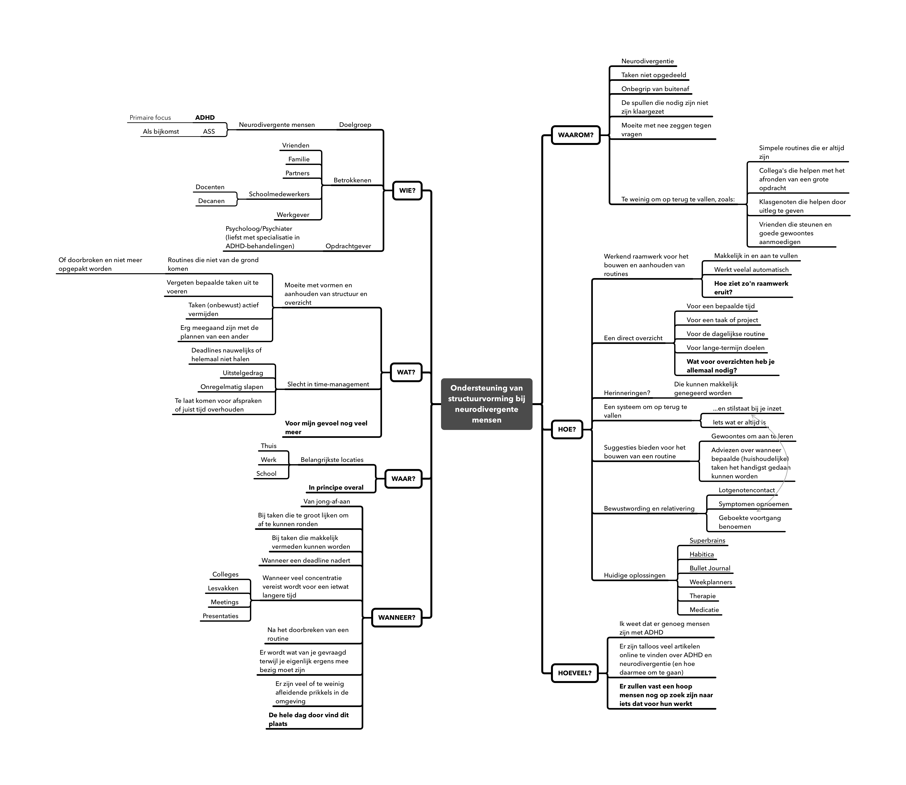

# Opdracht 1 - Probleem

## 1a. De probleemsituatie

### Samengevat

Neurodivergente mensen, en dan vooral mensen met ADHD, hebben veelal moeite om
structuur in hun leven aan te brengen en routines op te bouwen en vast te
houden. Een hoop factoren spelen hierin mee. Het is belangrijk voor iemand met
ADHD om zich vast te kunnen houden aan een stramien; een structuur waarop ze
terug kunnen vallen als de zaken niet lopen zoals verwacht. Denk aan een
deadline die nadert en de volledige headspace inneemt, een routine die voor de
zoveelste in het water valt, weinig tot geen overzicht doordat men steeds meer
achter de feiten aan begint te lopen. Er zijn genoeg manieren te noemen waarop
iemand met ADHD hun structuur kwijt kan raken. Al is er veel kennis over hoe je
een vast ritme aan kan houden als ADHD'er, genoeg mensen hebben alsnog moeite
mee hebben.

## 1b. De ontwerpopdracht

Ontwikkel een oplossing voor ADHD'ers, waarmee zij meer structuur in hun leven
krijgen en routines kunnen aanhouden. Ondanks dat er een hoop kennis beschikbaar
is, blijven sommige mensen telkens weer moeite te hebben met alles rondom ritme
en routine. Dat gebeurt op veel manieren en in meer of mindere mate en kan
betrekking hebben op elk onderdeel van iemand's leven. Het is daarom extra
belangrijk om de juiste balans te vinden tussen een rigoureus, voorgekauwd
stramien en een leeg canvas dat te weinig sturing geeft. Met de oplossing is het
mogelijk voor mensen met ADHD om stapsgewijs hun leven te structureren zonder
dat ze meteen de afgrond invallen als het even niet gaat zoals verwacht.

### Design challenges

1. Wat zijn de belangrijkste valkuilen voor een ADHD'er en hoe kan je ze (steeds
   beter) vermijden?
2. Hoe vang je iemand met ADHD op de juiste manier op nadat een routine is
   verstoord, zodat zij die weer oppakken?
3. Welke tools en methode kan een ADHD'er gebruiken om effectief en veerkrachtig
   een routine op te bouwen?
4. Wat zijn gewoontes die de structuur van het leven van een ADHD'er versterken?
