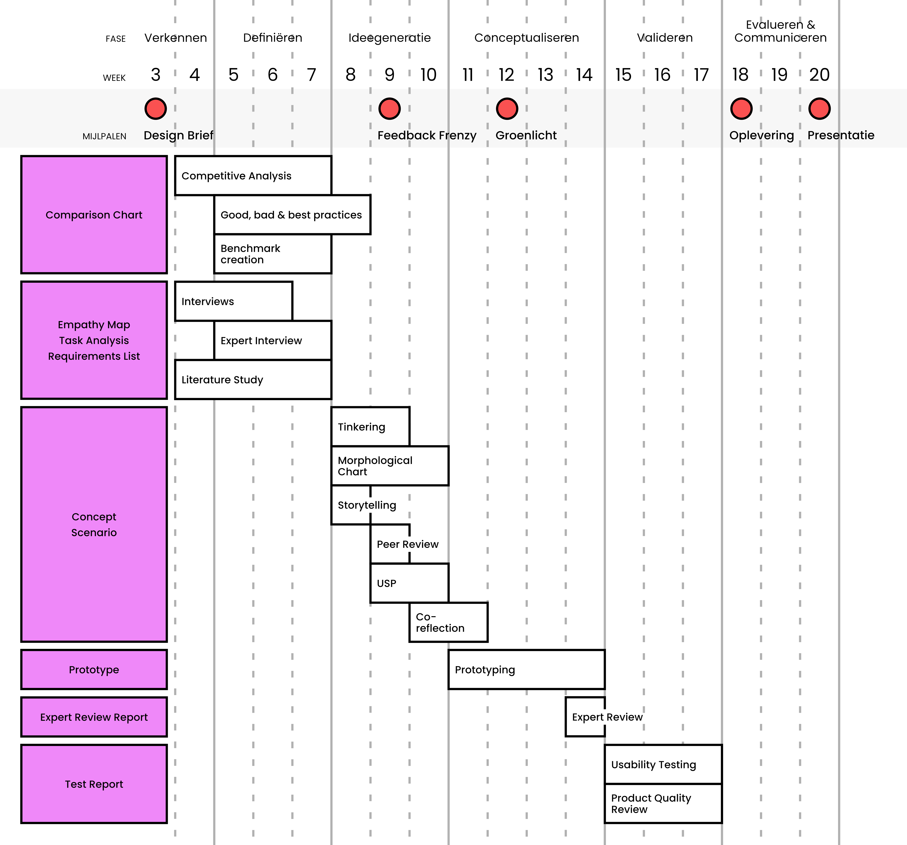

# Belangrijke mijlpalen en planning

Hieronder vind je de planning die ik voor het project heb gemaakt. Belangrijke mijlpalen van school staan bovenaan, en opleveringen (stepping stones) staan links in het paars. Gedurende weken ga ik ontwerpmethodes gebruiken die nodig zijn om de stepping stones te kunnen maken. Van onderzoeken die op nuttige manieren samengevat worden tot uiteenlopende ideeën die samengevat worden tot één concept; elke fase van het project ziet er anders uit dan de vorige.

