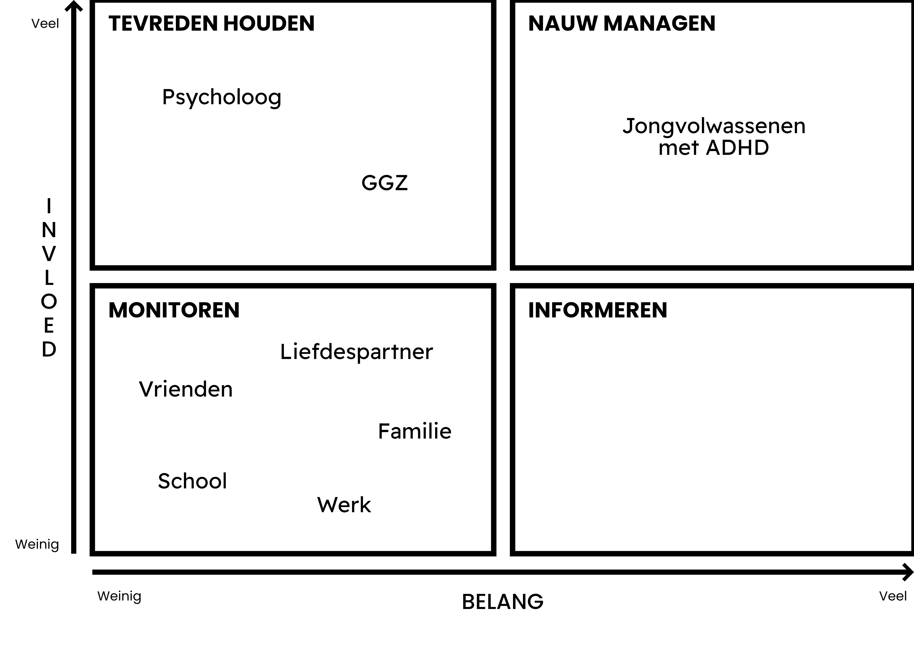

# Probleemsituatie

Jongvolwassenen met ADHD hebben door de symptomen van de afwijking meer moeite met het creëren van structuur in hun leven dan neurotypische jongvolwassenen. Dit komt doordat mensen met ADHD executief disfunctioneren. Dit houdt in dat, onder andere:

- Concentreren op "saaie" taken veel moeilijker is (dit kan ook gebeuren met dingen die je wel erg leuk vindt om te doen)
- Concentratie soms door kan slaan tot hyperfocus, waardoor je nergens anders meer oog voor hebt dan waar je op dat moment mee bezig bent
- Het moeilijker is om je emoties, impulsen en gedrag te reguleren
- Het moeilijker is om je directe omgeving (werkplek, huis) netjes en georganiseerd te houden
- Het plannen en houden aan tijdsgebonden afspraken moeilijker gaat door een gebrek aan tijdsbesef (tijd gaat heel snel of heel langzaam)
- Spullen constant kwijt raken omdat je niet weet waar je ze hebt gelaten of ze ergens anders hebt neergelegd dan normaal

En dan is er ook nog iets dat delay aversion heet. Hierbij vermijd je het uitstellen van het gevoel van voldoening die je krijgt bij het afronden van een grotere taak. Dit gebeurt in de vorm van een goede hit dopamine en serotonine vanuit het beloningscentrum in je brein. Je gaat bewust op zoek naar manieren om het beloningscentrum zo direct mogelijk te triggeren.

Al deze symptomen zorgen ervoor dat het opbouwen van routine en regelmaat voor iemand met ADHD erg moeilijk is, wat de rest van hun leven beïnvloedt. Bij vrienden, familie, binnen de relatie en op school en/of werk zijn de symptomen van ADHD op verschillende manieren een obstakel. Nadat ik in de theorie ben gedoken en heb gekeken naar de behandelmethode die wordt gehanteerd voor volwassenen met ADHD worden de symptomen in drie pilaren: time-management, organisatie en zelfacceptatie. Of er een goed werkend product is die deze drie pilaren gebruikt, ik heb 'm nog niet gevonden.

Bij de laatste pilaar, zelfacceptatie, wil ik even extra stilstaan. Het is namelijk blijkbaar zo dat mensen met ADHD zo erg met henzelf in de knoop zitten omdat ze anders zijn dat er extra aandacht aan besteed moet worden bij een behandeling. Samen met het feit dat het tot nu toe alleen over de gebreken gaat van een ADHD'er en er nog niet veel aandacht is besteed aan wat de sterke kanten zijn die bij ADHD horen. Op maatschappelijk niveau zijn verwachtingen waaraan iemand met ADHD niet zomaar aan kan voldoen. Daar wordt op neergekeken, terwijl er nauwelijks expliciet aandacht besteed wordt de positieve kanten van ADHD, zoals de vindingrijkheid, creativiteit en stressbestendigheid die mensen met ADHD vaker dan niet bezitten. Of hier iets aan verandert kan worden zal ik waarschijnlijk gaandeweg het onderzoek ontdekken.

Eén van de andere onderdelen in het onderzoek is het contact het interviewen van een psycholoog over deze probleem stelling. Dat is nog niet gelukt, maar ik heb wel van meerdere kanten te horen gekregen dat er interesse is en de kans groot is dat er binnenkort een interview plaatsvindt. De psycholoog wordt geen gebruiker van het product. Ik wil het doel van het product zo beknopt mogelijk houden zonder bochten af te snijden en hou de mogelijkheid voor een product die gebruikt kan worden bij therapie buiten beschouwing. De input die de psycholoog mij gaat geven zal sowieso veel impact hebben op het verloop van het project; elke vorm van betrokkenheid is al waardevol.

Het uiteindelijke product moet ook voldoen aan alle standaarden die de GGZ heeft omtrent producten die mensen met ADHD hulp bieden dat gebaseerd is op de psychologische kennis van nu. Zo heeft de GGZ voor apps de ggz-appwijzer. Hierop staan apps gecategoriseerd op psychische klachten of andere mentale aandoeningen met een score van de gestandaardiseerde Mindex test. De Mindex test is een kwaliteitstest; hoe hoger de score van een app, hoe hoger de kwaliteit volgens Mindex. Dit is handig om in het achterhoofd te houden, maar pas van toepassing als het concept en de vorm van het product vaststaat.

Hieronder zie je alle belanghebbenden bij dit project uitgewerkt in een stakeholder map zodat ik duidelijk kan maken welke stakeholders meer prioriteit en invloed krijgen dan anderen.

